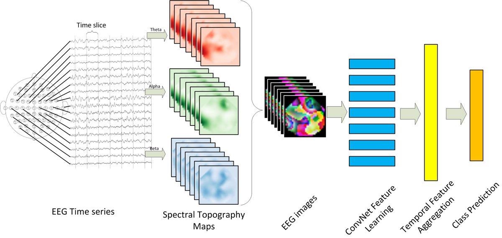

# EEGLearn
一组基于 “EEG images” 的 EEG 监督特征学习/心理状态分类的函数。

此代码可用于从正在进行的 EEG 活动中构建图像序列（EEG 电影片段），并通过递归卷积神经对不同的认知状态进行分类

网。更一般地说，它可以用来发现多通道时间序列记录中传感器之间具有已知空间关系的模式。输出图像中的每个颜色通道都可以包含为时间窗内的所有传感器计算的特定要素的值。



# Installation and Dependencies
In order to run this code you need to install the following modules:

Numpy and Scipy (http://www.scipy.org/install.html)

Scikit-Learn (http://scikit-learn.org/stable/install.html)

Theano (http://deeplearning.net/software/theano/install.html)

Lasagne (http://lasagne.readthedocs.org/en/latest/user/installation.html)

`pip install -r requirements.txt`

`pip install [path_to_EEGLearn]`

You can use the package in your code:
```
import eeglearn
import eeglearn.eeg_cnn_lib as eeglib

images = eeglib.gen_images(locs, features, nGridPoints)
eeglib.train(images, labels, train_test_fold, model_type)
```

# Some Notes:
1. When using the images to train a neural network, in many cases it is helpful to scale the values in the images to a symmetric range like `[-0.5, 0.5]`.
2. Images generated with `gen_images` function appear in the center of the field with unused space around them. This causes edges to appear around the images. To get around this, an edgeless option was added to gen_images function but I never systematically tried it to evaluate potential gains in performance.

Tensorflow implementation can be found here (thanks to @YangWangsky):

https://github.com/YangWangsky/tf_EEGLearn

PyTorch implementation (thanks to @VDelv):

https://github.com/VDelv/EEGLearn-Pytorch

# Reference
If you are using this code please cite our paper.

Bashivan, et al. "Learning Representations from EEG with Deep Recurrent-Convolutional Neural Networks." International conference on learning representations (2016).

http://arxiv.org/abs/1511.06448
